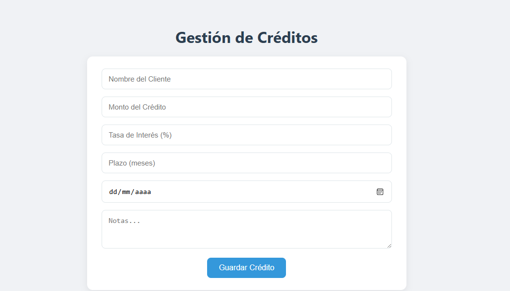
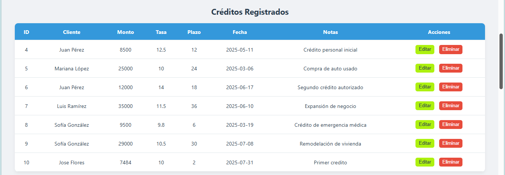
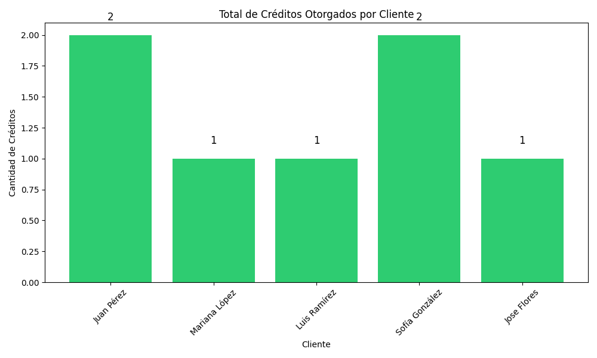
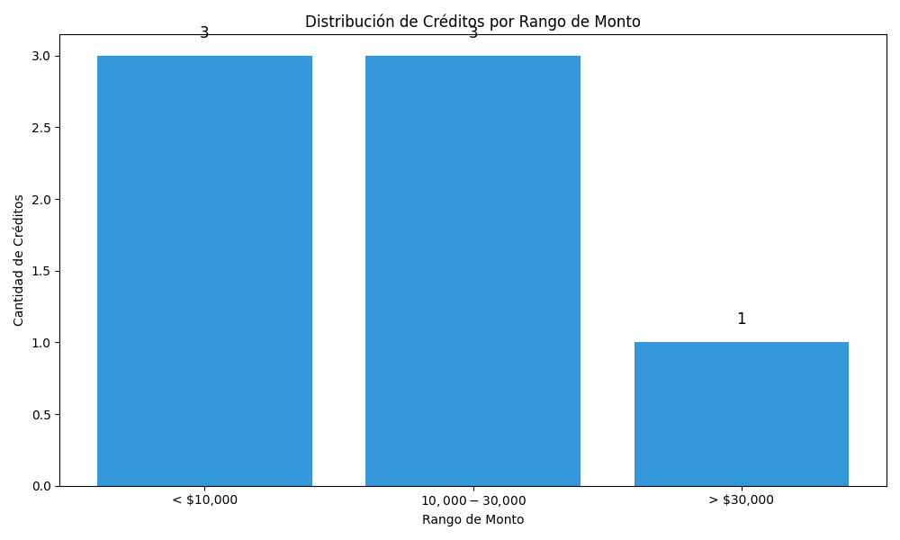

# Gestión de Créditos con Flask y SQLite

> Aplicación web para la gestión de créditos con visualización de datos en tiempo real.

---

## ✅ Tecnologías utilizadas

- Python 3 + Flask
- SQLite
- HTML + CSS + JavaScript
- Matplotlib (para gráficas)
- Git + GitHub

---

## 🚀 Instrucciones para instalar y ejecutar el proyecto

1. Abre tu terminal o consola.

2. Clona el repositorio:

```bash
git clone https://github.com/EsmeraldaCH/registro_creditos.git
cd registro_creditos
```

3. Crea un entorno virtual:

```bash
python -m venv venv
```

4. Activa el entorno virtual (en Windows):

```bash
venv\Scripts\activate
```

5. Instala las dependencias del proyecto:

```bash
pip install -r requirements.txt
```

6. Ejecuta la aplicación:

```bash
python app.py
```

---

## 🗃️ Base de Datos

El archivo `creditos.db` se crea automáticamente si no existe al registrar un crédito. Asegúrate de que el archivo `app.py` tenga permisos de escritura en el directorio.

Opcionalmente, puedes ejecutar el script `init_db.py` para crear la base de datos y su tabla inicial.

---

## 💻 ¿Qué incluye la interfaz?

- Formulario para registrar créditos
- Tabla que muestra los créditos registrados
- Botones para editar y eliminar cada crédito
- Diseño limpio y moderno con validaciones básicas

---

## 📊 ¿Qué muestran las gráficas?

- Gráfica de barras del total de créditos otorgados por cliente
- Gráfica de barras de la distribución de créditos por rango de monto
- Se actualizan automáticamente al registrar, editar o eliminar un crédito

---

## 🌐 Rutas importantes

- Página principal: `http://localhost:5000/`
- Gráfica total de créditos: `http://localhost:5000/grafica`
- Gráfica por rango de montos: `http://localhost:5000/grafica2`

---

---

## 🖼️ Capturas de Pantalla

### 📝 Formulario de Créditos
  
Formulario donde puedes ingresar los datos del cliente, monto del crédito, tasa de interés, plazo en meses, fecha de otorgamiento y notas adicionales. También permite editar o limpiar los campos.

---

### 📄 Créditos Registrados
  
Tabla dinámica que muestra todos los créditos registrados con sus datos completos. Incluye botones para editar o eliminar cada crédito fácilmente.

---

### 📊 Total de Créditos por Cliente
  
Gráfica de barras que muestra el **monto total de créditos otorgados por cliente**. Es útil para identificar a los clientes que han recibido mayor financiamiento.

---

### 📊 Distribución de Créditos por Rango de Monto
  
Esta gráfica de barras muestra cuántos créditos han sido otorgados dentro de tres rangos de monto:

< $10,000: Créditos pequeños

$10,000 - $30,000: Créditos medianos

> $30,000: Créditos grandes

Es útil para identificar en qué nivel económico se concentra la mayoría de los créditos otorgados.
---

## 📦 Requisitos

- Python 3.9 o superior
- Navegador (Chrome, Edge, Firefox)

---

## 📥 Recomendación para compartir el proyecto

Ejecuta este comando para guardar las librerías que usaste:

```bash
pip freeze > requirements.txt
```

Esto genera el archivo `requirements.txt`, necesario para que otros puedan instalarlo.

---

## 👩‍💻 Desarrollado por

**Esmeralda Cruz**  
Proyecto técnico para **Delta Data Consulting**  
Julio 2025 ✨
